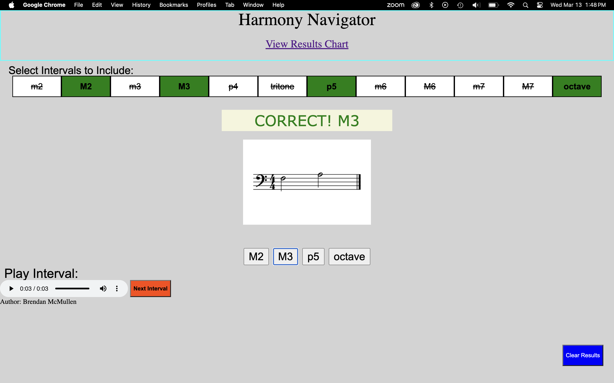

  <a href="https://linkedin.com/in/brendangmcmullen/" target="_blank" rel="noopenernoreferrer">&nbsp;&nbsp;</a>
  &nbsp;&nbsp;

  

## SUMMARY
AI Engineer & Full-Stack Developer with a PhD in Music Composition from the University of Pennsylvania and a background in education and audio technology. I build human-centered AI tools using PyTorch, LangChain, and RAG pipelines. Skilled in React, Django, and cloud deployment (Azure, AWS), with a focus on making AI both useful and accessible.
### Technologies: 
Langchain, Pytorch, TensorFlow, Numpy, Large Language Models (LLMs), Azure, TypeScript, JavaScript, Python, React, React Native, PostgreSQL, Node, Django

## Featured Projects

### Tower Race – [Live App](https://tower-race.netlify.app/) | [Frontend Source Code](https://github.com/bgmcmullen/tower-race-frontend) | [Backend Source Code](https://github.com/bgmcmullen/tower-race-server)
\
•	Tower Race is a simple single player game where the play must build and optimize their tower using bricks, competing against an AI opponent.\
•	Player vs. AI Gameplay: Compete against an AI opponent with a robust strategy for building stable towers.\
•	Real-Time WebSocket Communication: Smooth, real-time updates of game state.\
•	Interactive Animations: Animated tower building and dynamic feedback for player actions.\

### Blackjack+ – [Live App](https://black-jack4445.netlify.app) | [Frontend Source Code](https://github.com/bgmcmullen/BlackJack-plus) | [Backend Source Code](https://github.com/bgmcmullen/BlackJack-plus-server)
\
•	Blackjack+ is a twist on classic blackjack. The goal is to get as close as possible to the target score without going over. Unlike traditional blackjack, the target score changes each round!\
•	The computer dealer uses a PyTorch-based model trained on simulated Blackjack+ scenarios to make decisions during gameplay.\
•	To simulate human-like behavior, the AI plays faster when it’s more confident in its decision, and slower when it’s uncertain\
