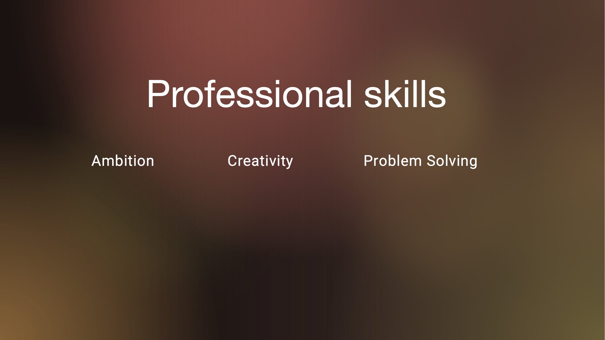

<!DOCTYPE html>
<html lang="en">
<head>
<meta charset="UTF-8">
<meta name="viewport" content="width=device-width, initial-scale=1.0">
<title>GitHub Home Page</title>

</head>
<body>

  <a href="https://linkedin.com/in/brendangmcmullen/" target="_blank" rel="noopener noreferrer">
    &nbsp;&nbsp;
  </a>

  

  

  
  

</body>
</html>
